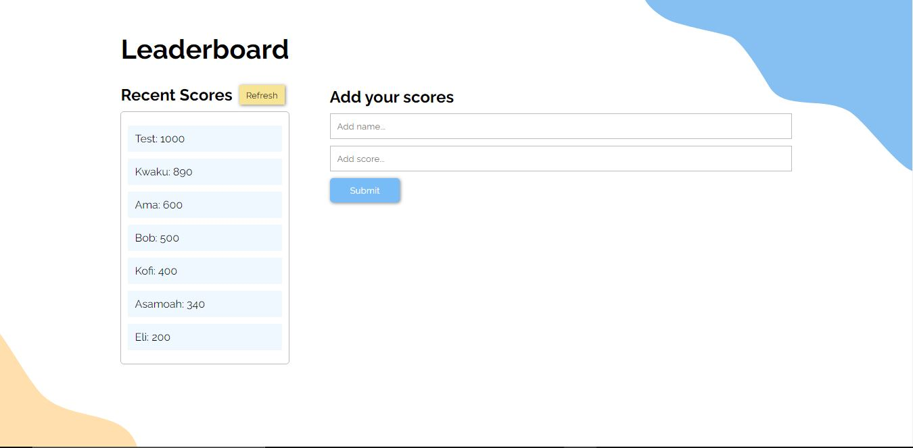

# LEADERBOARD

> The leaderboard website displays scores submitted by different players. It also allows you to submit your score. All data is preserved thanks to an external Leaderboard API service.

Additional description about the project and its features.

## Built With

- HTML
- CSS
- Javascript
- Webpack
- REST Api

## Getting Started

To get a local copy up and running follow these simple example steps.

### Prerequisites

- Knowledge on basic html and css
- Text Editor (VScode, Atom, Sublime text, etc)
- Basic knowledge of node.js

### Setup

- clone repository using `git clone`
- git clone `https://github.com/Amedzro-Elikplim/Leaderboard`
- cd `Leaderboard`.
- run `npm install`
- run `npm run start` to start webpack dev server

## Author
👤 **Amedzro Elikplim Emmanuel**

- GitHub: [@Amedzro-Elikplim](https://github.com/Amedzro-Elikplim)
- Twitter: [@ElikplimAmedzro](https://twitter.com/Amedzro-Elikplim)
- LinkedIn: [Emmanuel Elikplim Amedzro](https://www.linkedin.com/in/emmanuel-elikplim-amedzro-187590125/)

## 🤝 Contributing

Contributions, issues, and feature requests are welcome!

Feel free to check the [issues page](../../issues/).

## Show your support

Give a ⭐️ if you like this project!

## 📝 License

This project is [MIT](./LICENSE) licensed.